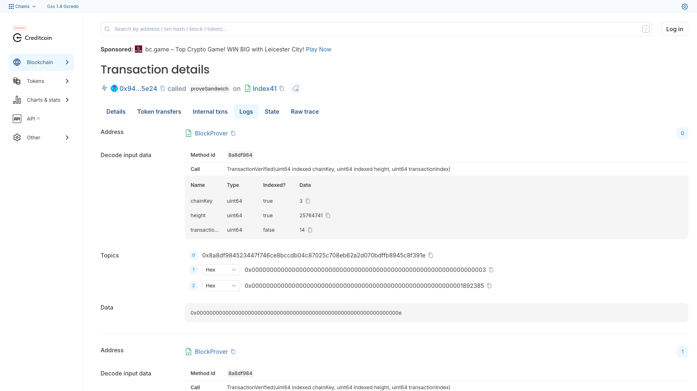

# DEMO — index41 in five screens

For the numbers and the links, read [`JUDGE.md`](JUDGE.md); it is the receipt. This file is the
walkthrough for someone who has not cloned anything yet — what the product looks like, in order,
with a note under each screen saying exactly what in it is real.

Every screenshot below is **unretouched**, captured on **2026-08-16** from the app running locally
and from public block explorers. Nothing was composited, recoloured or cropped. Where a third-party
explorer shows its own advertising slot, that banner is left in frame rather than edited out —
removing it would mean editing evidence.

---

## The architecture, before anything else


Three of block `25,764,741`'s 240 transactions are touched. Everything expensive happens off-chain
and for free; exactly one Creditcoin transaction spends gas.

---

## 1 · The demo surface


`npm install && npm run dev` → `http://localhost:3000`. No `.env`, no wallet, no API key, no account.

The four tiles are read, not typed: `14 · 15 · 16` comes from the `TransactionVerified` logs the
Attestcoin precompile itself wrote, and the page decodes them on every load.

---

## 2 · The mechanism — why nothing else can see this


The worked example on the right is the whole idea in one panel. `RLLLRRRR`, read leaf → root with
`L → 1` and `R → 0`, is `01110000`; taken least-significant-first that is `+2 +4 +8` — **position 14**.

The position was never written down anywhere. It was recovered from the *shape* of the proof, which
is why it cannot be disputed. Creditcoin exposes exactly this as `calculateTxIndex`, and it is a
`view`, so it costs nothing.

---

## 3 · The ruling — five logs of one Creditcoin transaction


One transaction does all of it: three verifications, three position recoveries, the ordering
assertion, the harm computation and the payout. `paid == computed`.

The right-hand panel shows the off-chain decode and the precompile's on-chain emission **side by
side** — so they can be seen agreeing, rather than asserted to agree.

---

## 4 · The same event, decoded by a stranger



This is not our UI. The contract is source-verified, so Blockscout decodes the events on its own:
`chainKey 3` (Ethereum mainnet), `height 25764741`, `transactionIndex 14`. Two more identical
events follow with `15` and `16`.

Nothing on this page came from us except the bytecode.

---

## 5 · The judge page


`/judge` is the same evidence written for one reader. The first row of the receipt names its own
provenance — `LIVE CHAIN READ` here — so you always know whether the page in front of you just
talked to a node or fell back to the committed capture. There is no third source and no mock.

---

## Run it yourself

```bash
# the demo surface — zero config
npm install && npm run dev            # → http://localhost:3000  (and /judge)

# re-read every live source and diff the committed artifact
node scripts/capture-proof.mjs --check
# → "committed artifact MATCHES a fresh live capture"

# the contract suite
npm test                              # forge test --summary — 120 tests, 4 suites

# the E2E suite (needs a build first)
npm run build && npm run e2e          # 48 tests
```

And the check that needs no clone at all — one position, over someone else's API:

```bash
curl -s https://eth.blockscout.com/api/v2/transactions/0xec3777f9d0e55d03b9caa3a4b8a786dd62e16eeb327a9f1c45dfbc79af618436 | jq .position
# 14
```

## Where to go next

| | |
|---|---|
| The receipt, and every link in one place | [`JUDGE.md`](JUDGE.md) |
| The full argument and the Attestcoin surface table | [`README.md`](README.md) |
| How the proof is built and audited | [`docs/PIPELINE.md`](docs/PIPELINE.md) |
| Every deploy, bond and balance | [`docs/DEPLOYMENT.md`](docs/DEPLOYMENT.md) |
| The ruling transcript, and the same run with no proof service | [`docs/pipeline-output.txt`](docs/pipeline-output.txt) · [`docs/pipeline-output-local-prover.txt`](docs/pipeline-output-local-prover.txt) |
| Pitch deck (PDF) | [`docs/index41-pitch-deck.pdf`](docs/index41-pitch-deck.pdf) |
