<div align="center">
  
  <h1>index41 ⚖️</h1>
  <p><em>Proves transaction A executed <b>before</b> transaction B inside an Ethereum block — a fact carried in no payload and readable by no oracle — and makes a relay's bond pay for breaking its no-sandwich promise.</em></p>
  

  <p>
    A <b>real Ethereum mainnet sandwich</b> (block <code>25,764,741</code>, positions <b>14 → 15 → 16</b>)
    ruled on by a bonded contract on Creditcoin CC3, in
    <a href="https://creditcoin-testnet.blockscout.com/tx/0xd136dea0524b7e0e9eba54bf9724eec78597c2598047a96849af727f4d243810">one real transaction</a>
    — status <code>1</code>, 1,092,100 gas, <b>1.456%</b> of <code>MAX_GAS_CAP</code>. The positions are
    not hardcoded in the page's code path: they are decoded, on every page load, from the
    logs the Attestcoin precompile itself wrote (a committed capture of that same read backs the
    page when a live one is unreachable — see below). <b>120 Foundry tests, 0 failed.</b>
  </p>

  <br/>

  [](JUDGE.md)
  [](https://creditcoin-testnet.blockscout.com/tx/0xd136dea0524b7e0e9eba54bf9724eec78597c2598047a96849af727f4d243810)
  [](docs/PIPELINE.md)
  [](https://dorahacks.io/hackathon/buidl-ctc-2026-fall)

  <br/>

  
  
  
  
  
  
  [](LICENSE)

</div>

---

> **A note on the name.** The icon's `41 → 42 → 43` is this project's fingerprint — an illustrative
> three-slot rhythm, not a result. The sandwich that was actually proven on-chain sits at
> **14 → 15 → 16**, and every number in this document, in the tests and on the demo page is that
> real one. Nothing here presents `41/42/43` as a live output.

## 📸 See it in Action

```bash
npm install
npm run dev          # http://localhost:3000 — no .env, no wallet, no API key, no account
                     # /judge — the same evidence, written for one reader
```

The page shows three rows of Ethereum mainnet block `25764741` lighting up in sequence —
**14 searcher buy · 15 the victim · 16 searcher sell** — then `SandwichProven` and the bond paying
out. **Those indices are not hardcoded in the page's code path.** They are decoded, on every page
load, from the three `TransactionVerified` logs the Attestcoin precompile itself wrote inside the
receipt of CC3 transaction
[`0xd136dea0…d243810`](https://creditcoin-testnet.blockscout.com/tx/0xd136dea0524b7e0e9eba54bf9724eec78597c2598047a96849af727f4d243810).

A banner above the ledger states which of the two **real** sources is on screen — a live chain read,
or the committed [`data/proof-artifact.json`](data/proof-artifact.json) capture of that same read if
the public node is unreachable — and there is no third source. There is no demo mode, no mock and no
toggle anywhere in this repository.

Alongside each index the page shows the laterality decode that produced it (`RLLLRRRR → 14`), the
real sibling hashes it was folded from, and the position the precompile emitted, so the off-chain
and on-chain answers can be seen *agreeing* rather than asserted to agree.

Verify one position against a complete stranger's API, no clone required:

```bash
curl -s https://eth.blockscout.com/api/v2/transactions/0xec3777f9d0e55d03b9caa3a4b8a786dd62e16eeb327a9f1c45dfbc79af618436 | jq .position
# 14
```

## 💡 The Problem & Solution

### The Problem

A private RPC or block-builder relay sells one promise: *route through us and you will not be
sandwiched.* When that promise breaks, the victim has a screenshot and the relay has a denial.
The dispute is unresolvable on-chain for one structural reason — **the harm is entirely a fact about
ordering**, and a transaction does not carry its own position. There is no `tx.index` field. No
oracle reports it. No `eth_call` can be proven for it. A sandwich is three transactions that only
become an attack when you can show that one landed *between* the other two, and that "between" is
exactly what no payload contains.

### The Solution

A relay posts a CTC bond on Creditcoin behind its no-sandwich promise. A victim submits three
Ethereum transaction hashes from the same block. `Index41.proveSandwich` then:

1. **Verifies** each of the three transactions with `INativeQueryVerifier.verifyAndEmit(...)` —
   three sequential calls in one Creditcoin transaction, sharing one continuity proof.
2. **Recovers each transaction's ordinal position inside its block** by calling
   `INativeQueryVerifier.calculateTxIndex(merkleProof)` — a free `view` that decodes position out of
   the left/right laterality of the merkle authentication path. Every sibling on the path is one
   bit; the position is the *shape of the proof*, not a claimed field.
3. **Asserts the sandwich shape**: `frontRunIndex < victimIndex < backRunIndex`, that all three legs
   emitted a `Swap` log *from the same pool address* (`PoolNotTouched` otherwise — note this is the
   log emitter, not the transaction's `to`, which legitimately differs across routers), the same
   searcher as sender on the outer two, and a higher priority fee on the front-run.
4. **Computes harm** as the attacker's *realized profit* — front-run `amountIn` versus back-run
   `amountOut`, both read from `Swap` logs that are inside the proof. Never a counterfactual against
   a pre-sandwich reserve ratio: Attestcoin commits transaction history, not state, so there is no
   state to counterfactually compare against, and a contract that claimed otherwise would be lying.
5. **Pays the victim** from the relay's bond and marks the claim `processedQueries` so the same
   sandwich cannot be claimed twice.

Ordering is not in any payload. The merkle authentication path *is* the position — that is the
entire foundation of this contract, and it is the one thing nothing else here can do.

## 🏗️ Architecture & Tech Stack

```
  Ethereum mainnet                    Creditcoin CC3
  block 25,764,741                    (chainId 102031)
  ┌──────────────────┐
  │ 14 searcher buy  │──┐
  │ 15 the victim    │──┼─→ 3 proofs ─→ Index41.proveSandwich
  │ 16 searcher sell │──┘   (1 shared      │
  └──────────────────┘   continuity proof) │
                                           ├─ 3× INativeQueryVerifier.verifyAndEmit
                                           │     → TransactionVerified(3, 25764741, 14/15/16)
                                           ├─ 3× calculateTxIndex(merkleProof)   [free view]
                                           │     → position, from left/right laterality
                                           ├─ assert 14 < 15 < 16
                                           ├─ EvmV1Decoder → Swap logs → realized profit
                                           └─ pay victim from the relay's CTC bond
                                                 → SandwichProven · HarmPaid
```

Off-chain, the proving pipeline never trusts the party that served it a proof: every bundle is
re-encoded from mainnet, re-folded leaf → root, and its continuity proof chained down to a
checkpoint Creditcoin already holds — **before a single unit of gas is spent**.

| Layer | Technology | Why |
|---|---|---|
| Court | Solidity 0.8, contract extending `USCBase` | the ruling has to happen *inside* contract control flow, not be reported to it |
| Verification | `INativeQueryVerifier` precompile (`verifyAndEmit`, `calculateTxIndex`) | the only on-chain surface that answers "what position was this?" |
| Decoding | `EvmV1Decoder` deployed library, linked on chain | `Swap` logs → realized profit, from the same bytes the precompile verified |
| Tests | Foundry — **120 unit tests**, 4 suites | including a 256-leaf exhaustive round-trip of the decode |
| Pipeline | TypeScript + `@gluwa/usc-sdk` 0.18.0, ethers v6 | three interchangeable proof sources behind one interface |
| Demo | Next.js 16 (App Router), Tailwind, ShadCN | server component reads the ruling off CC3 before first paint |
| E2E | Playwright — **48 tests**, chromium + Pixel 7 | asserts invariants, never the literal indices |
| Chain | Creditcoin CC3 testnet (102031), Blockscout | source-verified contract, so the explorer decodes it itself |

## 🏆 Attestcoin Protocol Integration

The single published judging criterion for this hackathon is *depth of Attestcoin Protocol
utilization*. This section is the evidence, stated as a table rather than a claim.

### The honest depth claim

The official examples repo has **exactly one file** that imports the SDK, and the whole exercised
surface is **3 methods on 2 classes** (`ProofBuilder` ctor → `waitUntilHeightAttested` → `getProof`,
plus `getLatestAttestedHeightAndHash`). That is the field's baseline.

> **index41 makes 36 distinct Attestcoin surfaces load-bearing, 24 of them undocumented.
> On a clean default run (`npm run prove`, zero flags) 30 of them do real work — 33 if you also
> count the standby proof sources being constructed. All 36 execute across the default and
> `--kill-hosted` runs.**

**The number to hold us to is 30, not 36**, and the gap is worth spelling out rather than hiding,
because it is exactly the kind of thing a surface count is normally used to smuggle past a reader.
The proof layer is a three-rung ladder. On a default run rung 1 answers in 619 ms, so rungs 2 and 3
are *built* but never asked a question. That splits the 36 three ways, and every line of it is
checkable against the committed transcript
[`docs/pipeline-output.txt`](docs/pipeline-output.txt):

| On a zero-flag `npm run prove` | Count | Which |
|---|---:|---|
| Surfaces that do real work | **30** | everything not listed below |
| Constructed, never queried — the standby rungs | 3 | `service.ProofBuilder`, `raw.RawProofBuilder`, `SimpleBlockProvider` (ctor) |
| Not reached at all — the standby rungs' working calls | 3 | `ProofBuilder.getBatchProof`, `RawProofBuilder.getProof`, the implemented `BlockProvider` |
| **Total, across default + `--kill-hosted`** | **36** | `--kill-hosted` removes the hosted sources, so rungs 2 and 3 answer |

So the honest headline is **30 on the default path, 36 across both runs — never 36 unqualified.**
Both runs produce the same merkle root and the same ruling; transcripts in
[`docs/pipeline-output.txt`](docs/pipeline-output.txt) and
[`docs/pipeline-output-local-prover.txt`](docs/pipeline-output-local-prover.txt). "Undocumented"
means **absent from docs.creditcoin.org**, not "hard to find".

*Reconciliation, re-run for this document:* every surface below that the project's 325-surface
capability ledger catalogues was checked against it row by row — **32 of 32 rows agree, zero
disagreements, zero symbols missing from the ledger**. The ledger is authoritative and the table
below carries its verdicts, not a second opinion. The four proof-gen HTTP endpoints fall outside
that ledger's SDK scope and are classified against the prover's own published OpenAPI spec and the
docs site (2 documented, 2 not). The totals therefore land at **36 surfaces / 24 undocumented /
12 documented**, and
[`docs/PIPELINE.md`](docs/PIPELINE.md#attestcoin-surfaces-this-pipeline-makes-load-bearing) states
the identical numbers.

### The surface table

| # | Surface | Namespace | Documented? | Load-bearing for |
|---:|---|---|---|---|
| 1 | `PrecompileChainInfoProvider` | `chainInfo` | yes | every chain read; also injected into `RawProofBuilder` |
| 2 | `.getSupportedChainByKey` | `chainInfo` | **no** | refuses to run unless chain key 3 really maps to chainId 1 |
| 3 | `.getAttestationGenesisHeight` | `chainInfo` | **no** | the provable-history floor; required by the local continuity builder |
| 4 | `.getLatestAttestedHeightAndHash` | `chainInfo` | **no** | the attested tip the target block is measured against |
| 5 | `.getContinuityBounds` | `chainInfo` | **no** | the parent/child range the continuity proof must span |
| 6 | `.waitUntilHeightAttested` | `chainInfo` | **no** | the wait — driven by its fifth parameter `extraDelayMs` (15,269 ms → 317 ms) |
| 7 | `.getAttestationHeightForDigest` | `chainInfo` | **no** | binds a recomputed continuity digest to a real attestation |
| 8 | `.getCheckpointForHeight` | `chainInfo` | **no** | …or, as here, to checkpoint `0x5492ed3c…d197` at height 25,764,800 |
| 9 | `BLOCK_PROVER_PRECOMPILE_ADDRESS` | `blockProver` | yes | the verifier address, and the filter for the precompile's own logs |
| 10 | `PrecompileBlockProver` | `blockProver` | yes | the free preflight, before any gas is committed |
| 11 | `.verifySingle` | `blockProver` | yes | all three legs dry-run to `true` before a claim is built |
| 12 | `.computeTransactionIndex` | `blockProver` | **no** | position recovered off-chain, cross-checked against the contract's answer |
| 13 | `service.ProofBuilder` | `proofProvider` | yes | proof-ladder rung 2 † |
| 14 | `service.ProofBuilder.getBatchProof` | `proofProvider` | yes | proof-ladder rung 2 — the SDK's own untouched batch call ‡ |
| 15 | `raw.RawProofBuilder` | `proofProvider` | yes | proof-ladder rung 3 — the prover-free path † |
| 16 | `raw.RawProofBuilder.getProof` | `proofProvider` | **no** | the call that actually works for a single-block batch (`getBatchProof` cannot express one) ‡ |
| 17 | `raw.blockProvider.SimpleBlockProvider` (ctor) | `proofProvider` | **no** | `new SimpleBlockProvider(rpc)`, wrapped by this repo's `CachingBlockProvider` † |
| 18 | `raw.blockProvider.BlockProvider` | `proofProvider` | **no** | **implemented**, not just called — 925 mainnet round-trips avoided per local run ‡ |
| 19 | `merkle.hashLeaf` | `proofProvider` | **no** | the leaf hash for the independent merkle walk in `src/audit.ts` |
| 20 | `merkle.hashInner` | `proofProvider` | **no** | the walk itself — leaf → root, one bit of laterality per sibling |
| 21 | `merkle.computeDigestOf` | `proofProvider` | **no** | folds the continuity digest chain that lands on Creditcoin's checkpoint |
| 22 | `getTransactionWithRaw` | `encoding` | **no** | re-encodes the leaf straight from mainnet |
| 23 | `abiEncode` | `encoding` | **no** | …and compares it byte for byte with what the proof source served |
| 24 | `EncodingVersion` | `encoding` | yes | V1, for both the re-encode and the local prover |
| 25 | `gas.computeGasLimit` | `utils` | **no** | the submitted gas limit — `pallet-evm` drops precompile revert reasons during estimation |
| 26 | `gas.MAX_GAS_CAP` | `utils` | **no** | the 75,000,000 ceiling every claim is held against |
| 27 | `gas.gasAsPercentageOfMax` | `utils` | **no** | headroom before and after (it truncates — see the note in `src/claim.ts`) |
| 28 | `hex.bytesInHexString` | `utils` | **no** | calldata size: 17,860 bytes for the ruling |
| 29 | `decoder.decodeEvmV1Transaction` | `utils` | **no** | the whole off-chain preflight decode, `trackGas` included |
| 30 | `GET /api/v1/health` | proof-gen API | yes | reported before anything else runs |
| 31 | `GET /api/v1/attested-height/{chain_key}` | proof-gen API | yes | the adaptive poller's clock |
| 32 | `POST /api/v1/proof-batch/{chain_key}` | proof-gen API | **no** | the primary proof source — keyed by **block position**, and no SDK binding exists for it |
| 33 | `ErrorResponse.retriable` / `last_attested_block` | proof-gen API | **no** | the backoff schedule — probed every run before the poller relies on it |
| 34 | `INativeQueryVerifier.verifyAndEmit` | on-chain | yes | three sequential calls inside one Creditcoin transaction |
| 35 | `INativeQueryVerifier.calculateTxIndex` | on-chain | **no** | **the product** — ordinal position, from merkle laterality |
| 36 | `EvmV1Decoder` (deployed library, 9 public selectors) | on-chain | yes | linked into `Index41` on chain; also called off-chain by the preflight |

**36 rows · 12 documented · 24 undocumented · 30 doing real work on a zero-flag default run.**
† constructed on a default run but never queried — the hosted rung answers first.
‡ not reached on a default run at all; `--kill-hosted` is what forces them.
The other 30 rows execute on every run, no flags.

Per-surface reasoning, measurements and the deliberate exclusions: [`docs/PIPELINE.md`](docs/PIPELINE.md#attestcoin-surfaces-this-pipeline-makes-load-bearing).

### Why only Attestcoin — the SDK is the engine, not decoration

Remove Attestcoin from this repository and the product does not degrade; it stops existing. The
replacement bill is worth itemising, because it is unusually concrete.

**There is no oracle for ordering, and there cannot easily be one.** A transaction's ordinal
position inside its block is not a field anywhere in Ethereum. It is not in the RLP payload, not in
the receipt, not in any log, not returned by `eth_call`, and not derivable from anything the
transaction itself commits to. It exists in exactly one place: a block's transactions are committed
as a merkle tree, and a transaction's position is the **left/right bit-string of its authentication
path**. Every sibling on that path is one bit — left or right — and the concatenation of those bits
*is* the index in binary. `INativeQueryVerifier.calculateTxIndex` reads that bit-string on chain,
for free, as a `view`. Nothing else in the entire Attestcoin surface area answers this question, and
nothing outside it answers the question at all. This is why the headline surface of the project is
an undocumented one: the fact index41 is built on is a fact that only a merkle proof can carry.

**The alternative is a committee, and its output is a signature, not a proof.** The honest
substitute is an oracle network willing to attest arbitrary historical Ethereum transactions —
not prices, not a feed, but "transaction `0xec37…` was the 14th transaction of block 25,764,741".
No production oracle network sells that product, so you would be standing one up yourself: choosing
signers, bonding them, defining slashing, and running the whole thing for the lifetime of every
bond your contract underwrites. And when it is finished, `Index41` would be verifying an ECDSA
signature over a claim. The contract would be trusting the committee's word about Ethereum. Today
the contract re-derives the fact from the block's own merkle commitment and reverts if it does not
hold. Those are different security models, and only one of them survives the committee being wrong.

**You would also need a bespoke indexer to make individual fields checkable in a contract.**
Ordering alone does not make a sandwich. The claim also requires that all three transactions hit the
same pool — which means a `Swap` log *emitted by* that pool inside each leg's proven receipt, not a
matching `to` address, since the three legs in the demo route through different contracts — that the
outer two share a sender, that the front-run paid the higher priority
fee, and — for harm — the `amountIn` and `amountOut` of the `Swap` logs the attacker actually
emitted. Today those come out of the *same verified bytes* through `EvmV1Decoder`'s selectors and
`utils.decoder.decodeEvmV1Transaction`, so every field the contract branches on is inside the thing
the precompile verified. Without Attestcoin, each of those fields is a separate assertion a separate
service must make, and every one of them is a new place to lie. The economically interesting part —
harm is the attacker's realized profit, so paying it out cannot exceed what was proven — depends on
the log values and the ordering being **one** proof rather than several correlated claims.

**And a bridge, and it would still be the weakest link.** Getting any of this from Ethereum to
Creditcoin without Attestcoin means a message bridge with its own validator set, its own liveness
assumptions and its own honest-majority assumption, sitting underneath a contract whose entire
selling point is that it does not take anyone's word for anything.

**The surfaces are forced by the design, not sprinkled on top.** The pipeline never trusts the party
that served it a proof, and that single decision forces most of the table: `encoding.getTransactionWithRaw`
plus `abiEncode` to re-encode the leaf from mainnet and diff it byte for byte; `merkle.hashLeaf` and
`merkle.hashInner` to re-fold leaf → root independently; `merkle.computeDigestOf` chained across the
60 continuity roots to a digest that `chainInfo.getCheckpointForHeight` confirms Creditcoin already
holds at height 25,764,800. That last step binds an off-chain blob to on-chain state, off-chain and
for free — and it is what makes swapping the prover a non-event rather than a leap of faith. The
same refusal-to-trust produced the third proof source, `RawProofBuilder` over an implemented
`BlockProvider`, which rebuilds the block's merkle tree from mainnet with **no proof service in the
loop at all** and reproduces the hosted root byte for byte.

None of these are calls added to lengthen a list. Delete any one of them and something in the
pipeline stops being checkable: the leaf becomes unverified, the root becomes hearsay, the continuity
proof becomes unanchored, or the claim becomes un-runnable when the hosted prover is down.

### Deliberately not used

Depth is not surface count for its own sake, so three tempting families were left out on purpose:

- **The 62-surface `queryBuilder` selector API.** `EvmV1Decoder` already returns sender, entry
  point, value, nonce, gas limit, receipt status, gas used and the full log set from the same bytes
  the precompile verified. Spending a selector budget on facts that are already free would be
  decoration.
- **`proofProvider.mergeProofs`.** It throws on non-contiguous ranges, and three legs of one block
  are not a range at all.
- **`PrecompileBlockProver.verifyBatch` / `verifyAndEmitBatch`.** TypeScript-side only — there is no
  on-chain batch verify, which is exactly why a claim makes three sequential `verifyAndEmit` calls
  in one transaction and why the gas gate mattered on day 3.

## ⛓️ Live Deployment

A real Ethereum **mainnet** sandwich, ruled on by a bonded contract on Creditcoin. The contract is
source-verified, so Blockscout decodes the calls and events itself.

| | |
|---|---|
| Index41 (source verified) | [`0xb37Bc52b9d6f7431Ba8Be4deD4f53281Efb10eC2`](https://creditcoin-testnet.blockscout.com/address/0xb37Bc52b9d6f7431Ba8Be4deD4f53281Efb10eC2) · CC3 testnet, chainId `102031` |
| The ruling — 3× `verifyAndEmit` in one transaction | [`0xd136dea0…d243810`](https://creditcoin-testnet.blockscout.com/tx/0xd136dea0524b7e0e9eba54bf9724eec78597c2598047a96849af727f4d243810) · status `1` · block `5,317,821` · 5 logs |
| Source of truth | Ethereum **mainnet** block [`25,764,741`](https://eth.blockscout.com/block/25764741) — 240 transactions, a real MEV sandwich |
| Positions recovered | **14 → 15 → 16** (searcher buy · victim · searcher sell), from merkle-path laterality via `calculateTxIndex` |
| Off-chain vs on-chain | `RLLLRRRR → 14` · `LLLLRRRR → 15` · `RRRRLRRR → 16` — the local decode and the precompile's emitted index agree on all three |
| Ordering assertion | `front 14 < victim 15 < back 16` — holds |
| Harm paid from the bond | `219,708` wei → the address the *proof* says was sandwiched. Paid == computed. |
| Gas | `1,092,100` — **1.456%** of `MAX_GAS_CAP` (75,000,000) for 3× `verifyAndEmit` + 3× `calculateTxIndex` + the ordering assert + the events |
| Day-one spike | `OrderProbe.proveOrder` returned `[14, 15, 16]` live from the real precompile — 292,376 gas, **0.390%** of the cap ([`docs/spike-output.txt`](docs/spike-output.txt)) |
| Contract tests | **120** Foundry unit tests, 4 suites, **0 failed** |

**Reproduce the whole packet in one command — no key, no `.env`, no wallet:**

```bash
npm install && npm run capture:check
```

It re-reads the CC3 receipt, Ethereum mainnet block `25764741` and the prover live, re-derives the
three positions, and diffs the result against the artifact committed in this repository:

```
CC3     receipt  block 5317821 · status 1 · 5 logs
ETH     block 25764741 · 240 transactions
PROVER  proof-batch answered in 1216ms · cached=false
        mainnet agrees: 0xec3777f9d0… is at position 14
        mainnet agrees: 0x7b054188f7… is at position 15
        mainnet agrees: 0xb0cae362c6… is at position 16

--check: committed artifact MATCHES a fresh live capture
```

Deploy tx, bond tx, before/after balances and every explorer link — including the three real mainnet
transactions the ruling is over: [`docs/DEPLOYMENT.md`](docs/DEPLOYMENT.md). How the proof is built,
audited and made prover-independent: [`docs/PIPELINE.md`](docs/PIPELINE.md).

## 📊 Engineering Rigor

**120 Foundry unit tests, 0 failed:**

```
Index41MechanismTest   19   wiring, constants, position recovery from merkle laterality
Index41BondTest        26   posting/accumulating a bond, declaring coverage, the unbond clock
Index41ClaimTest       52   the sandwich-shape assertion and every way to fail it
Index41HarmTest        23   realized-profit accounting, replay protection, double-claim guards
```

| Layer | Tool | Result on this repo |
|---|---|---|
| Contracts | Foundry · `forge fmt --check` | **120 tests**, 4 suites, 0 failed · formatter clean |
| Exhaustive verification | Foundry | **256 positions** — every leaf of the depth-8 tree round-tripped |
| Code quality | ESLint 9 (`next/core-web-vitals` + `next/typescript`) · `tsc --noEmit` | clean at `--max-warnings=0` |
| E2E | Playwright, chromium + Pixel 7 | **48 tests** — zero config, no `.env`, no wallet |
| Performance | Lighthouse CI over `/` and `/judge` | perf **100** · a11y **96** · best-practices **100** · SEO **100** |
| Security — SAST | CodeQL (`javascript-typescript`, `security-and-quality`) | weekly + every push/PR |
| Security — secrets | gitleaks over the **full git history** + working tree, TruffleHog | no leaks found |
| Security — SCA | `npm audit` (production tree, blocking) + Dependabot | **0 vulnerabilities** in the shipped tree |
| CI/CD | GitHub Actions — 6 stages, parallel, concurrency-cancelled | contracts + TypeScript + Next, all three gated |

The one exhaustive test rather than an example:
`test_TxIndexOfRoundTripsEveryPositionInTheTree` walks **all 256 leaves** of the depth-8 tree and
asserts the laterality decode round-trips to the position for every one. The decision function that
must never be wrong is verified over its whole input space, not on three cases.

Test names say what they actually assert. `Index41MechanismTest`'s three
`test_MockDecodesLiveMainnetLateralityTo{Fourteen,Fifteen,Sixteen}` tests assert against
`MockVerifier`'s Solidity reimplementation of the laterality algorithm — unit tests run on a bare
EVM, where the real precompile address holds no code — so they prove the mock, and their names say
so. The **real** precompile was confirmed separately and live on CC3 against the same three paths
([`docs/spike-output.txt`](docs/spike-output.txt), and again in
[`docs/DEPLOYMENT.md`](docs/DEPLOYMENT.md)).

A note on the E2E suite, because it is the easy place to cheat: **none of the 48 tests assert `14`,
`15` or `16`.** They assert invariants — that each leg's off-chain laterality decode equals the index
the precompile emitted, that the three positions are strictly increasing, that harm paid equals harm
computed, and that the page names which of the two real sources it used. A test that hard-coded the
indices would still pass against a page that had hard-coded them too, which is precisely the failure
this repository exists to avoid.

Solidity is formatted by `forge fmt`. TypeScript deliberately is **not** run through Prettier — the
source is hand-formatted with aligned comment blocks that carry meaning. The formatting gate that
exists is the one that can be met exactly.

## 🚀 Getting Started

### Prerequisites

Node 20+ and npm. Foundry (`forge`) only if you want to run the contract suite. Nothing else —
no `.env`, no wallet, no API key and no account on the default path.

### Installation

```bash
git clone --recurse-submodules <repo-url>   # lib/forge-std is a submodule; only `npm test` needs it
npm install
npm run dev                    # http://localhost:3000  ·  /judge for the one-page argument
```

Already cloned without it? `git submodule update --init` — the demo path above does not care, but
`forge` resolves `forge-std/` from `lib/forge-std/src/` and nowhere else.

### Reproducing the live proof

```bash
node scripts/capture-proof.mjs --check   # re-read every live source, diff the committed artifact
                                         # → "committed artifact MATCHES a fresh live capture"
```

The full on-chain run needs a funded CC3 key at `~/.config/creditcoin/index41-testnet.json`, which
is read at runtime and is **never** in this repository:

```bash
npm run build:cc3                              # links Index41 against Creditcoin's deployed EvmV1Decoder
npm run prove -- --fresh-court                 # deploy → bond → declare coverage → prove → pay, on CC3
npm run prove -- --kill-hosted --fresh-court   # the same ruling, with the hosted prover switched off
```

No flags are required and **none of them switch the judged capability on or off** — `--kill-hosted`
only changes which of the three interchangeable proof sources answers. Re-running against a court
that already ruled on this sandwich stops at `ALREADY RULED`: the replay guard, transcript committed
at [`docs/pipeline-output-replay.txt`](docs/pipeline-output-replay.txt).

## 🧪 Testing & CI

```bash
npm ci
forge build                    # default profile — unit tests link their own EvmV1Decoder
npm test                       # forge test --summary — 120 tests, all four suites
npm run test:gas               # per-test gas report

npm run build && npm run e2e   # Playwright — 48 tests, chromium + mobile, zero config
npm run lint                   # ESLint over app/ src/ scripts/
npm run typecheck              # tsc --noEmit
npm run lighthouse             # Lighthouse CI over / and /judge
npm run secrets                # gitleaks over the full git history AND the working tree

npm run ci                     # ESLint + tsc + forge fmt --check + 120 forge tests + npm audit
npm run ci:full                # …plus the Next production build and the 48-test Playwright suite
make security-scan             # the above, plus npm audit and a licence check
```

## 📁 Project Structure

```
contracts/src/
  Index41.sol             the court — bonding, coverage, proveSandwich, harm accounting, payout
  OrderProbe.sol          the day-one spike: does calculateTxIndex really recover position, and do
                           3× verifyAndEmit fit in one tx under MAX_GAS_CAP — before any product code
  interfaces/INativeQueryVerifier.sol   the precompile interface, exactly as Creditcoin ships it
  base/USCBase.sol        shared USC-SDK plumbing (kept unmodified from the vendored source)
contracts/test/           120 Foundry unit tests, 4 suites

src/                      the TypeScript proving pipeline (npm run prove)
  prove.ts                entrypoint — resolve block, wait for attestation, fetch, audit, decode,
                           dry-run, submit, read back the ruling
  proof-sources.ts        three interchangeable proof sources behind one interface
  caching-block-provider.ts  implements the SDK's BlockProvider; back-fills from fetched blocks
  audit.ts                never trusts a proof source: re-encodes, re-folds, chains continuity
  claim.ts                builds the claim struct, budgets gas, submits, parses events
  court.ts · eth.ts · config.ts · prover-api.ts · artifacts.ts · log.ts

scripts/
  spike.ts                the day-one live-network spike (docs/spike-output.txt)
  find-sandwich.ts        scans real Ethereum mainnet blocks for MEV sandwiches
  capture-proof.mjs       freezes the ruling into data/proof-artifact.json — and refuses to write
                           one whose own decode disagrees with the chain

data/sandwich-25764741.json   the recorded real mainnet sandwich the default run proves
data/proof-artifact.json      the ruling, captured from live sources

app/                      the demo surface (Next.js 16, App Router)
  page.tsx                server component — reads the ruling off CC3 before the first paint
  judge/page.tsx          /judge — the claim, the click path, the receipt, the limitations
  _lib/chain.ts           plain JSON-RPC + receipt decoding; no SDK, no wallet, no secret
  _components/ProofTheatre.tsx   the ledger: three rows of block 25764741 lighting in sequence
  api/proof/route.ts      re-reads the chain on demand, behind the page's own button

e2e/                      48 Playwright tests — invariants, never literal indices
.github/workflows/        CI (6 stages) · CodeQL · gitleaks
```

## 🗺️ Scope & Roadmap

- [x] `calculateTxIndex` recovering position from merkle laterality, on chain
- [x] The three-way ordering assertion `front < victim < back`
- [x] A real Ethereum **mainnet** sandwich, ruled on with real CC3 transaction hashes on Blockscout
- [x] Harm as the attacker's realized profit, paid from the bond, replay-guarded
- [x] A prover-free proof path that reproduces the hosted merkle root byte for byte
- [ ] Multi-relay registry — cut deliberately; one bonded relay ships
- [ ] Historical-claim browser — cut deliberately; one claim, one demo
- [ ] Automatic sandwich detection on chain — the caller supplies three hashes;
      `scripts/find-sandwich.ts` finds real ones off-chain

The web surface is deliberately **one page about one ruling**: it reads the chain and shows the
decode, and it cannot submit a claim — claiming needs a funded key, which belongs in `npm run prove`
and not in a judge's browser. Wallet connection is one optional footer button that adds the CC3
network; nothing on the default path touches it.

## ⚠️ Limitations

Disclosed rather than discovered.

- **It cannot prove state.** Attestcoin commits transaction *history* — a merkle root over
  `abiEncode(tx, rx)`. Post-state is never committed, so there are no proofs over `eth_call`,
  storage slots or `balanceOf` anywhere in this codebase. The design consequence is concrete and
  load-bearing: harm is the attacker's **realized profit** read from proven `Swap` logs, never a
  counterfactual against a pre-sandwich reserve ratio. A contract offering the counterfactual would
  be unsound, so this one does not offer it.
- **Writability does not exist.** Creditcoin reads Ethereum; it cannot write back. Every mechanism
  here is one-directional by construction — no round-trips, no acknowledgement path to mainnet.
- **There is no on-chain batch verification.** `INativeQueryVerifier` exposes exactly
  `verifyAndEmit` and `calculateTxIndex`; `verifyBatch` is TypeScript-side only. A claim is
  therefore three sequential `verifyAndEmit` calls inside one transaction, which is why the gas
  measurement against `MAX_GAS_CAP` was a day-3 go/no-go gate rather than a footnote.
- **It does not detect sandwiches on chain.** The caller supplies three transaction hashes and the
  contract rules on them.
- **Three of the 120 unit tests prove the mock, not the precompile** — and are named accordingly.
  Unit tests run on a bare EVM where the precompile address holds no code. The real precompile was
  confirmed live on CC3, separately.
- **One bonded relay, one ruling, testnet, unaudited.** The deployed contract has ruled once, on the
  sandwich above. The bond is play money until it is not.
- **Ethereum mainnet only** (Attestcoin chain key 3). Sandwiches essentially do not occur on
  Sepolia, and the demo needs a real one.

## 📄 License

MIT — see [`LICENSE`](LICENSE).

## 🙏 Acknowledgments

Built on the Attestcoin Protocol and `@gluwa/usc-sdk` 0.18.0 for **BUIDL CTC 2026 Fall**
(DoraHacks), DeFi track. The sandwich is real, and someone really lost the money.
